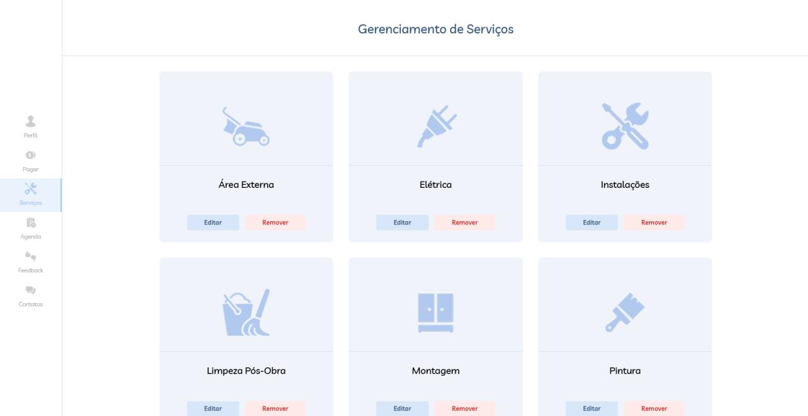

🌎 Languages: **English** | [Português](README.pt-BR.md)
# 💼 ADM Soluções

Web system designed to organize and optimize service operations, connecting clients and administration in a single digital environment.

The platform allows clients to browse services, schedule appointments, send messages, make payments, and submit reviews.  
The administrative panel provides full operational control, simplifying user, schedule, and service management.

 

## 🚀 Features

### Client
- View available services  
- Schedule appointments  
- Send messages  
- Make payments  
- Rate services  

### Administrator
- Create and edit services  
- Manage users  
- Control appointments  
- View feedback  

 

## 🛠 Technologies

- PHP  
- HTML  
- CSS  
- MySQL  

 

## 💡 Usability

The interface was designed to be intuitive, with simple navigation and quick access to key features, making service management faster and more efficient.

 

## 📸 System Interface

### Service Management

### Service Schedule

 

## ▶ How to Run

1. Clone the repository  
2. Set up the database  
3. Configure `db_connect.php`  
4. Run on a local server (XAMPP/WAMP)
